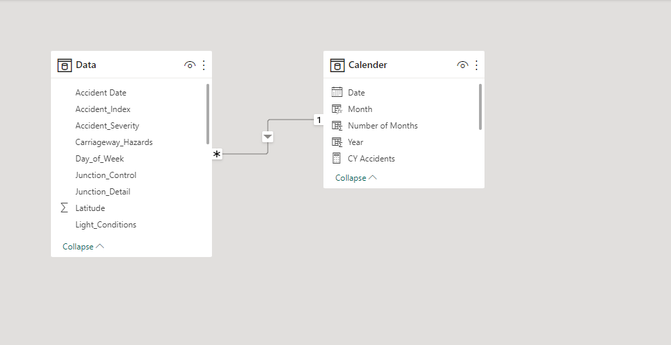
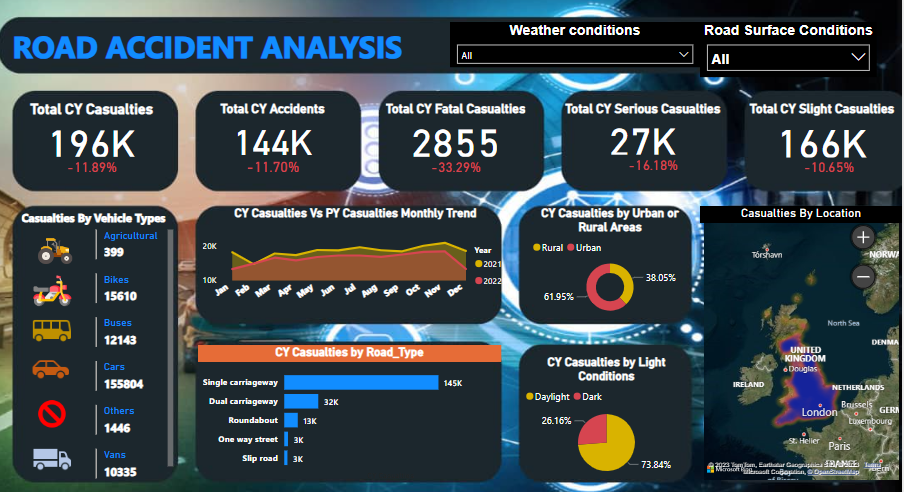

# Road Accident Data-Analysis

## Introduction
I will be playing the role of a data analyst hired by the Ministry of Transport. I have been tasked to
Analyze and create dashboard for a road accident dataset for 2021 and 2022.

## Problem Statement
Primary KPIs: – Total Casualities and Total Accident values for current year and YOY growth.
Primary KPI's: Total Casualties by Accident Severity for the current year and YOY growth
Secondary KPI's: – Total Casualties with respect to vehicle type for the current year.
Monthly trend showing comparison of casualties for the current year and previous year
Casualties by road type or current year.
Current Year Casualties by Area/Location and by Day/Night.
Total Casualties and Total Accidents by Location.

## Skills Demonstrated
The following PowerBI features were incorporated.
-Quick measures
-Filter
-Model

## Modelling

You can interact with the report [here](https://app.powerbi.com/groups/me/reports/03f33334-9106-405e-9809-3647c1eac251/ReportSection?experience=power-bi)

## Analysis:
### Total Accidents
We have a total number of 418K casualties during 2021-2022.
The Total current year casualties is 196K and the current year growth is -11.89%.
The total current year accident is 144K and current year growth is -11.70%.
The total current year fatal accidents is 2855 and the current year growth -is 33.29%, serious accidents 27K, current year growth -is 16.18%, slight accidents 166K, and current year growth is -10.65%.

### Casualties by Vehicle type
We have a total number of 155,805 accidents caused by cars followed by bikes

### Casualties by road type
A total number of 145K casualties had accidents on The single-carriageway.

